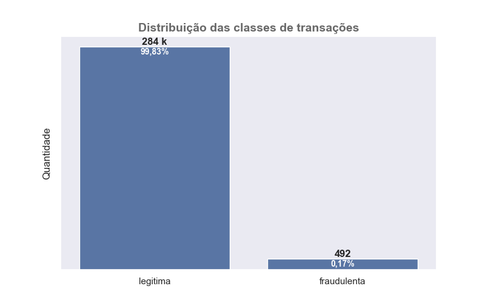
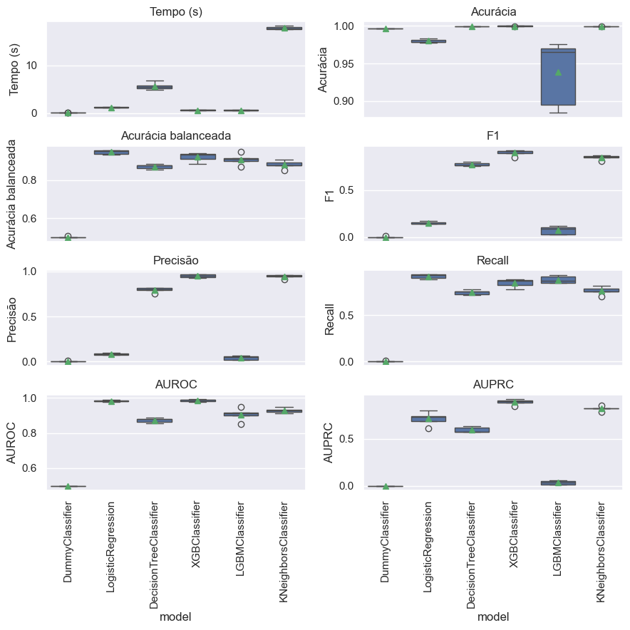
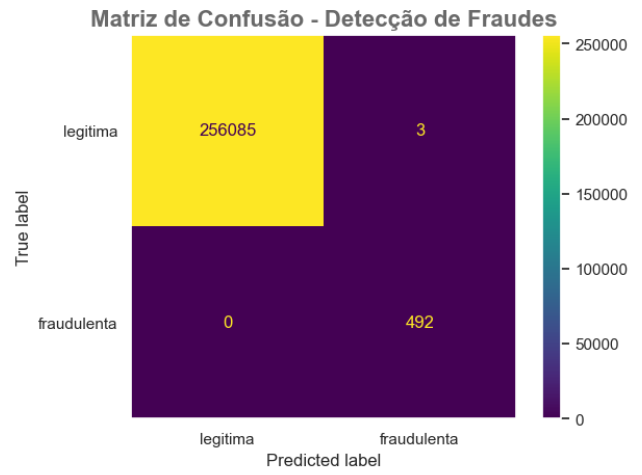

# 🧠 Detecção de Fraudes em Transações Financeiras com Machine Learning

---
## 📋 Descrição do Projeto

Este projeto tem como objetivo desenvolver um modelo de **machine learning supervisionado** capaz de **identificar transações potencialmente fraudulentas em cartões de crédito**, utilizando um conjunto de dados reais anonimizados.  

A detecção de fraudes é um dos desafios mais relevantes no setor financeiro, exigindo soluções que conciliem **precisão, velocidade e interpretabilidade** para minimizar perdas e proteger clientes.

---
## ⚖️ Desbalanceamento

Um dos principais desafios deste projeto é o **forte desbalanceamento entre as classes**, algo comum em problemas reais de detecção de fraudes.  
O conjunto de dados contém **284.807 transações**, sendo apenas **492 fraudulentas (0,17%)** e **284.315 legítimas (99,83%)**.  

Esse cenário torna o problema especialmente difícil, pois um modelo que previsse “não fraude” para todos os casos ainda teria **acurácia de 99,8%**, mas **não teria utilidade prática**.  
O modelo **XGBoost** foi configurado com um **ajuste ponderado entre as classes (`scale_pos_weight`)**, o que permitiu uma aprendizagem mais equilibrada e maior sensibilidade à classe minoritária.



---
## 🧩 Principais resultados
O estudo foi dividido em três partes principais, cada uma com seu próprio caderno na pasta `notebooks`:

1. **Análise exploratória e pré-processamento nos dados:** identificação de padrões entre transações legítimas e fraudulentas, padronização e normalização dos atributos, tratamento de outliers e variáveis desbalanceadas. Para verificar quais variáveis realmente apresentavam relação significativa com a variável alvo, foi aplicado o teste não paramétrico U de Mann–Whitney, ideal para distribuições assimétricas e sem pressuposto de normalidade. [Caderno 1](notebooks/01-jb_eda.ipynb)

2. **Comparação de modelos e seleção final:** foram avaliados modelos lineares, baseados em árvore e KNN. O XGBoost apresentou o melhor equilíbrio entre *recall*, *precision* e *AUPRC*, sendo escolhido como modelo final.  
   - O **XGBClassifier** permite o ajuste de pesos entre classes, dispensando reamostragem manual.
   - Sua estrutura baseada em *gradient boosting* com regularização L1/L2 o torna ideal para grandes volumes de dados e alta assimetria entre classes. [Caderno 2](notebooks/02-jb_modelos.ipynb).
</br></br>
3. **Modelagem com subamostragem:** foi testado o uso do **XGBoost com subamostragem (undersampling)** para o equilibrio de classes antes do treinamento. No entanto, observou-se uma **queda no desempenho geral do modelo**, com **aumento significativo de falsos positivos** e menor capacidade de generalização. Por esse motivo, o método **não foi adotado na versão final** do projeto. [Caderno 3](notebooks/03-jb_modelos_rus.ipynb).

O desempenho do modelo final foi avaliado usando a Área Sob a Curva de Precisão-Recall (AUPRC), que é o equilíbrio entre Precisão e Recall. Abaixo, uma comparação das métricas do modelo:



---
## 📊 Conclusão

O **XGBoost ajustado com ponderação de classes** se mostrou a melhor solução para o problema de detecção de fraudes, apresentando **ótimo equilíbrio entre precisão e recall** mesmo diante de um forte desbalanceamento.  

O **processo de ajuste de hiperparâmetros (GridSearchCV)** utilizou como métrica de refit a **área sob a curva de Precisão-Recall (AUPRC)** — uma escolha apropriada para cenários de detecção de fraudes, pois enfatiza o desempenho em relação à classe minoritária e penaliza falsos positivos de forma mais realista.

O modelo **XGBClassifier** identificou corretamente **100% das 492 fraudes**, além de errar apenas **3 transações** dentre as **256.088** classificadas como legítimas, representando uma proporção extremamente pequena de **0,000012% de identificações incorretas**.

A matriz de confusão abaixo ilustra o desempenho final do modelo:


> Legenda:  
>- **True label:** Classe real da transação  
>- **Predicted label:** Classe prevista pelo modelo

Em síntese, o projeto evidencia a importância de modelos robustos e interpretáveis para a detecção de fraudes financeiras, mostrando como a ciência de dados pode apoiar decisões automatizadas e preventivas em contextos críticos de negócios.

---
## 💼 Possíveis Aplicações Práticas
A solução proposta pode ser aplicada em diferentes contextos:

- 🏦 **Instituições financeiras** — monitoramento em tempo real de transações para bloqueio automático de fraudes.  
- 💳 **Empresas de cartão de crédito e fintechs** — apoio à equipe antifraude na priorização de alertas e investigação de transações suspeitas.  
- 🛒 **E-commerces e plataformas digitais** — redução de *chargebacks*, fraudes em pagamentos e contas falsas.  
- 🔎 **Auditorias e compliance** — identificação de padrões anômalos em grandes volumes de dados financeiros.  
- 🧾 **Seguradoras e corretoras** — detecção de sinistros irregulares e comportamentos suspeitos em pedidos de indenização.  
- 💹 **Corretoras de investimentos e bolsas** — monitoramento de operações suspeitas e prevenção de lavagem de dinheiro (*AML*).  
- 🧠 **Centros de análise de risco** — integração de modelos preditivos em pipelines de *credit scoring* e concessão de crédito.  
- 🏢 **Empresas de consultoria e BPO financeiro** — desenvolvimento de soluções automatizadas de auditoria e controle interno.  
- 🧮 **Departamentos de contabilidade e tesouraria corporativa** — verificação automática de inconsistências em movimentações e reconciliações bancárias.  
 

Além do ganho operacional, o projeto demonstra **como a ciência de dados pode gerar valor direto ao negócio**, diminuindo perdas financeiras e melhorando a experiência do cliente.

---
## 📂 Estrutura do Projeto

```
├── dados/                  <- Conjunto de dados (.parquet, .zip)
├── modelos/                <- Modelos treinados e serializados
├── notebooks/
│   ├── 01-jb_eda.ipynb     <- Análise exploratória dos dados
│   ├── 02-jb_modelos.ipynb <- Modelos iniciais e métricas
│   ├── 03-jb_modelos_rus.ipynb <- Modelos com subamostragem
│   └── src/                <- Código-fonte modularizado
│       ├── config.py
│       ├── graficos.py
│       ├── models.py
│       └── models_rus.py
├── referencias/            <- Dicionário de dados e documentação
├── relatorios/             <- Imagens e relatórios gerados
├── identificacao_fraudes.yml <- Requisitos de ambiente Conda
├── LICENSE
└── README.md
```

---
## 🧰 Tecnologias Utilizadas
```
- Python 3.12.5
- pathlib
- Pandas, NumPy, Matplotlib, Seaborn
- Scikit-learn
- Scipy
- LightGBM
- XGBoost
- Imbalanced-learn
- Jupyter Notebook
- Conda / Anaconda
```

Todas as bibliotecas estão listadas no arquivo `identificacao_fraudes.yml`.

---
## ⚙️ Configuração do Ambiente

1. Faça o clone do repositório:
    ```bash
    git clone git@github.com:jaackbarbosa/detection_of_fraud_in_financial_transactions.git
    ```

2. Crie um ambiente virtual e exporte as dependências:
    ```bash
    conda env export > identificacao_fraudes.yml
    ```
---
## 📜 Licença

Este projeto está licenciado sob os termos da [MIT License](LICENSE). </br>
Esta licença é permissiva e permite que outros usem, modifiquem e distribuam seu código, desde que a licença original e os avisos de copyright sejam incluídos.

---
## 👤 Autor

**Desenvolvido por:** Jackson da Silva Barbosa  
🔗 [LinkedIn](https://www.linkedin.com/in/jaacksilva/)  
💻 [GitHub](https://github.com/jaackbarbosa)  

📍 Projeto voltado a aplicações reais em Ciência de Dados e Detecção de Fraudes Financeiras.